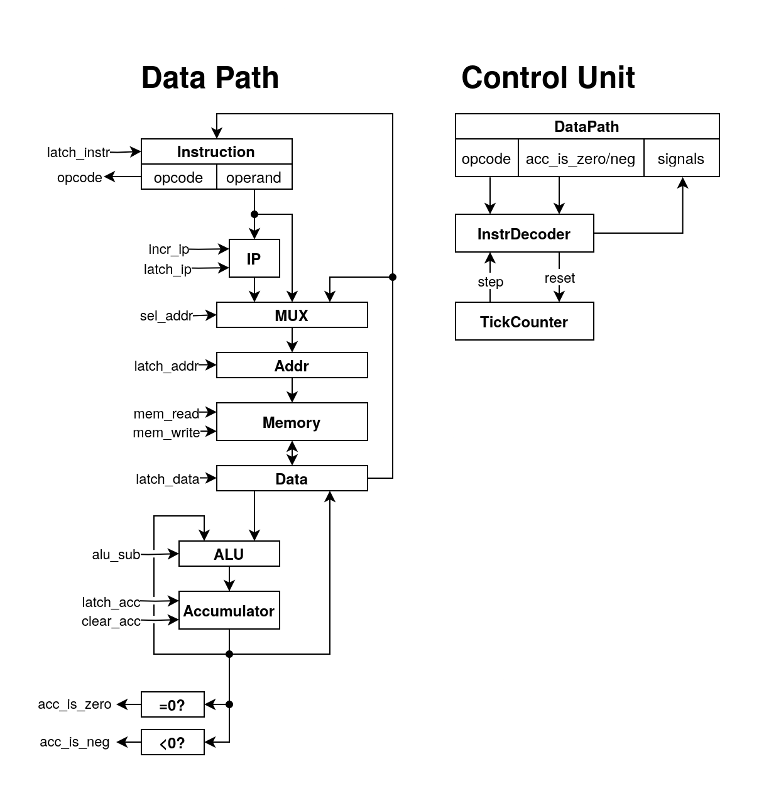

# Лабораторная работа №3

 - Марченко Анна Сергеевна, P33101
 - `lisp -> asm | acc | neum | hw | instr | struct | stream | mem | pstr | prob1 | [4]char`
 - Упрощенный вариант (asm вместо lisp)

## Язык программирования

Реализован язык ассемблера с поддержкой меток и строк

```ebnf
program ::= { line }

line ::= [ label ':' ] [ instr ] [ comment ]

label ::= { <any symbol except ' ' ':'> }

instr ::= mnemonic [ operand ]

mnemonic ::= "ld" | "st" | "ldi" | "sti"
           | "clr" | "add" | "sub"
           | "jz" | "jnz" | "js" | "jns" | "jmp"
           | "hlt" | "data" | "string"

operand ::= integer | string | label

integer ::= [ '-' ] <digit> { <digit> }

string ::= '"' { <any symbol except '"'> } '"'

comment ::= ';' { <any symbol except newline> }
```

Инструкции могут иметь операнд (максимум один), который представляет из себя:
 - Число - абсолютный адрес в памяти
 - Название метки - транслятор подставит на ее место абсолютный адрес

Помимо обычных инструкций, есть особые:
 - `data 123` - целое число, одно слово в памяти
 - `string "hello"` - определение pascal-строки. первым словом записывается длина, затем каждый символ по слову

Вопросы о стратегии вычислений, области видимости, типизации и т.д. неприменимы, так как язык не является высокоуровневым.

## Организация памяти

Используется общая память для кода и данных, реализованная в виде Python-списка.

Поскольку в задании не требуется реализовывать бинарное кодирование инструкций, в списке хранятся объекты класса `Word`
с полями `opcode` и `operand`. Небольшой хак: обычные данные хранятся в этом же классе с `opcode = DATA`.

Размер машинного слова не определен. Технически, он неограниченный, так как в Python целые числа - biginteger'ы. Но это всего лишь условность реализации.

Память однопортовая и позволяет за такт прочитать или записать 1 машинное слово.

Адресуются отдельные ячейки (не байты), размером в 1 машинное слово.

Программа начинает выполняться с адреса 0, поэтому обычно в начале памяти лежит код, а уже за кодом данные.
Так, в обычное программе по адресу 0 будет первая инструкция, 1 - вторая, 2 - третья, и т.д.
Однако, ничто не мешает в начале программы сделать `jmp` на произвольный адрес, и хранить код и данные в любом месте.

Ввод вывод - memory mapped. В реализации `DataPath` захардкожены адреса 1000 - порт ввода и 1001 - порт вывода. Отдельных инструкций ввода вывода нет.

Стек - отсутствует. Все переменные хранятся в обычной памяти, и следить за ними - задача программиста. 

## Система команд

Считается, что инструкция занимает 1 машинное слово (реализованного в виде Python класса).

Архитектура аккумуляторная, программе доступен всего один регистр.

В модели процессора также есть регистры, недоступные программе: регистр инструкции, регистр адреса и регистр данных.

### Набор инструкций

Инструкции делятся на 3 типа:

1. Арифметические инструкции:
   - `clr` (CLeaR) - очистить аккумулятор.
   - `add addr` - прибавить к аккумулятору число по адресу `addr`.
   - `sub addr` - вычесть из аккумулятора число по адресу `addr`.
2. Инструкции для работы с памятью
   - `ld addr` (LoaD) - загрузить в аккумулятор число по адресу `addr`. Старое значение аккумулятора безвозвратно теряется.
   - `st addr` (STore) - записать значение аккумулятора по адресу `addr`.
   - `ldi addr` (LoaD Indirect) - загрузить число из `addr`, трактовать его как адрес ячейки памяти, прочесть из нее значение и записать в аккумулятор
   - `sti addr` (STore Indirect) - аналогично инструкции `ldi`, только вместо чтения - запись.
3. Инструкции потока управления
   - `jmp addr` - установить IP (Instruction Pointer) в значение `addr`. Следующая инструкция будет считываться по указанному адресу.
   - `jz addr` (Jump if Zero) - переход, если аккумулятор равен 0.
   - `jnz addr` (Jump if Not Zero) - переход, если аккумулятор не равен 0.
   - `js addr` (Jump if Signed) - переход, если аккумулятор меньше 0.
   - `jns addr` (Jump if Not Signed) - переход, если аккумулятор не меньше 0 (больше либо равен 0).
   - `hlt` - остановка машины

Ассемблерные мнемоники `data` и `string` не являются инструкциями, а используются для записи произвольных данных в память машины.

### Кодирование инструкций

Код и данные кодируются в виде JSON списка. Индекс в списке соответствует адресу в памяти.
```json
[{"opcode": "st", "operand": 1001},
 {"opcode": "jmp", "operand": 2},
 {"opcode": "hlt", "operand": 0},
 {"opcode": "data", "operand": 13},
 {"opcode": "data", "operand": 72}]
```

Подробнее в модуле [isa](./isa.py).

## Транслятор

Интерфейс командной строки: `translator.py <input_file> <target_file>`

Реализован в модуле: [translator](./translator.py)

Файл с ассемблерным кодом считывается, разбивается на строки, и парсится в соответствии с грамматикой языка.
Отдельно обрабатывается мнемоника`string` для записи pascal-строк.
Особое внимание уделено корректной обработке меток в случае, если метка используется до объявления.

Ассемблерные мнемоники транслируются 1-в-1 в машинные инструкции, за исключением `data` и `string`.

## Модель процессора

Интерфейс командной строки: `machine.py <machine_code_file> <input_file>`

Реализован в модуле: [machine](./machine.py)



Описание Data Path:
 - Instruction - регистр инструкции. Записывается целиком, а считывать можно по частям - отдельно опкод и отдельно операнд.
   Запись производится по сигналу `latch_instr`, из регистра данных.
 - IP - Instruction Pointer. Регистр, хранящий адрес следующей инструкции.
   Можно инкрементировать сигналом `incr_ip`, или же полностью переписать значение сигналом `latch_ip`, новое значение возьмется из операнда инструкции.
 - MUX - мультиплексер, выбирающий значение для записи в адресный регистр. По селектору `sel_addr` выбирает значение `IP`, регистра данных, или операнда.
 - Addr - адресный регистр, хранит адрес ячейки памяти для чтения или записи. Защелкивается по сигналу `latch_addr` из вышеописанного мультиплексера.
 - Memory - память, одопортовая, чтение по сигналу `mem_read`, запись по `mem_write`. Работает с регистром адреса и регистром данных.
 - Data - регистр данных. Значение может быть записано из аккумулятора по сигналу `latch_data`, или же из памяти по сигналу `mem_write` (в таком случае явно `latch_data` не выставляется).
 - ALU - Арифметико-Логическое Устройство с поддержкой сложения и вычитания. Левый операнд - аккумулятор, правый - регистр данных.
 - Accumulator - собственно, аккумулятор. Можно очистить сигналом `clear_acc` (записать 0), либо записать результат АЛУ по сигналу `latch_acc`.
 - Блоки проверки значения аккумулятора `=0?` - проверяет на равенство нулю и `<0?` - проверяет на отрицательность. Используются для реализации условных команд.

Описание Control Unit:
 - Hardwired. Реализован полностью на Python. Основной метод - `next` - выполнить полный цикл инструкции.
 - InstrDecoder - дешифратор инструкции. Принимает опккод и флаги `acc_is_zero/neg` с Data Path,
   а также номер "шага" выполнения инструкции.
 - TickCounter - условный компонент. Инструкции требуют более одного такта для чтения, декодирования, и исполнения.
   В этом счетчике в реальном процессоре хранился бы номер "шага", на котором находится инструкция. В симуляторе не используется и задан неявно.

Моделирование останавливается:
 - по достижению инструкции `hlt`
 - при ошибке (например, при попытке чтения за пределами памяти)
 - при попытке ввода, если данные в потоке чтения закончились

Состояние процессора логируется после исполнения каждой инструкции.

## Тестирование

Реализованы golden tests, см. модуль [integration_test](./integration_test.py)

1. `hello` - [код](./examples/hello.asm), [тест](./golden/hello.yml).
2. `hello_user_name` - [код](./examples/hello_user_name.asm), [тест](./golden/hello_user_name.yml).
3. `cat` - [код](./examples/cat.asm), [тест](./golden/cat.yml).
4. `prob1` - [код](./examples/prob1.asm), [тест](./golden/prob1.yml).

Для запуска тестов:

```
$ poetry run coverage run -m pytest .
$ poetry run coverage report -m
```

Пример использования программы и журнал работы процессора на примере `cat`:
```
$ echo "hello" > /tmp/input.txt
$ cat examples/cat.asm
$ cat examples/cat.asm 
_start:     ld IN
            st OUT
            jmp _start
$ poetry run -- python translator.py examples/cat.asm /tmp/code.o
source LoC: 4 code instr: 3
$ poetry run -- python machine.py /tmp/code.o /tmp/input.txt 
DEBUG:root:   1. IP:    1 ADDR: 1000 DATA:      104 ACC:      104; ld 1000
DEBUG:root:   2. IP:    2 ADDR: 1001 DATA:      104 ACC:      104; st 1001
DEBUG:root:   3. IP:    0 ADDR:    2 DATA:  (instr) ACC:      104; jmp 0
DEBUG:root:   4. IP:    1 ADDR: 1000 DATA:      101 ACC:      101; ld 1000
DEBUG:root:   5. IP:    2 ADDR: 1001 DATA:      101 ACC:      101; st 1001
DEBUG:root:   6. IP:    0 ADDR:    2 DATA:  (instr) ACC:      101; jmp 0
DEBUG:root:   7. IP:    1 ADDR: 1000 DATA:      108 ACC:      108; ld 1000
DEBUG:root:   8. IP:    2 ADDR: 1001 DATA:      108 ACC:      108; st 1001
DEBUG:root:   9. IP:    0 ADDR:    2 DATA:  (instr) ACC:      108; jmp 0
DEBUG:root:  10. IP:    1 ADDR: 1000 DATA:      108 ACC:      108; ld 1000
DEBUG:root:  11. IP:    2 ADDR: 1001 DATA:      108 ACC:      108; st 1001
DEBUG:root:  12. IP:    0 ADDR:    2 DATA:  (instr) ACC:      108; jmp 0
DEBUG:root:  13. IP:    1 ADDR: 1000 DATA:      111 ACC:      111; ld 1000
DEBUG:root:  14. IP:    2 ADDR: 1001 DATA:      111 ACC:      111; st 1001
DEBUG:root:  15. IP:    0 ADDR:    2 DATA:  (instr) ACC:      111; jmp 0
DEBUG:root:  16. IP:    1 ADDR: 1000 DATA:       10 ACC:       10; ld 1000
DEBUG:root:  17. IP:    2 ADDR: 1001 DATA:       10 ACC:       10; st 1001
DEBUG:root:  18. IP:    0 ADDR:    2 DATA:  (instr) ACC:       10; jmp 0
DEBUG:root:  19. IP:    1 ADDR: 1000 DATA:  (instr) ACC:        0; ld 1000
INFO:root:output_buffer: 'hello\n'
```

В журнале:
 - номер выполненной инструкции
 - `IP` - значение Instruction Pointer, десятичное
 - `ADDR` - значение адресного регистра
 - `DATA` - значение регистра данных. В случае, если там лежит инструкция, пишется `(instr)`, поскольку нет бинарного кодирования
 - `ACC` - значение аккумулятора
 - выполненная инструкия

```
| ФИО                     | алг   | LoC | code байт | code инстр. | инстр. | такт. | вариант                                                                        |
| Марченко Анна Сергеевна | hello | 29  | -         | 30          | 124    | -     | asm | acc | neum | hw | instr | struct | stream | mem | pstr | prob1 | [4]char |
| Марченко Анна Сергеевна | cat   | 3   | -         | 3           | 37     | -     | asm | acc | neum | hw | instr | struct | stream | mem | pstr | prob1 | [4]char |
| Марченко Анна Сергеевна | prob1 | 170 | -         | 128         | 6826   | -     | asm | acc | neum | hw | instr | struct | stream | mem | pstr | prob1 | [4]char |
```
